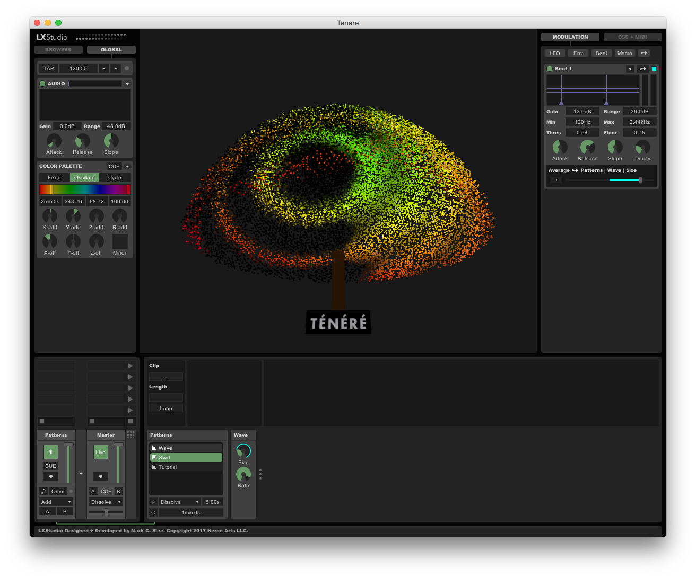

# Ténéré
This is the animation engine and development environment for the [Tree of Ténéré](https://www.treeoftenere.com/). It is an open-source application that runs in [Processing](https://processing.org/) using the [P3LX](https://github.com/heronarts/P3LX) framework.

To get started, grab the latest version of Processing 3 at:  https://processing.org/download/

Then, simply clone or download the repo and open the project in Processing. Enjoy!

